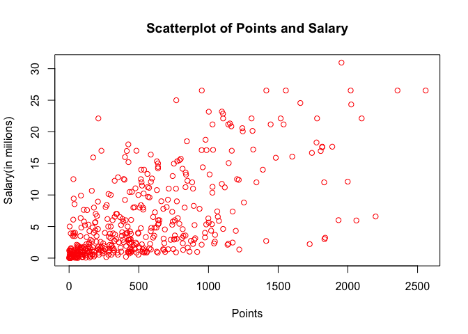
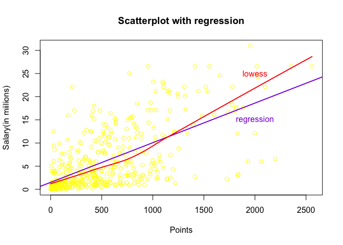
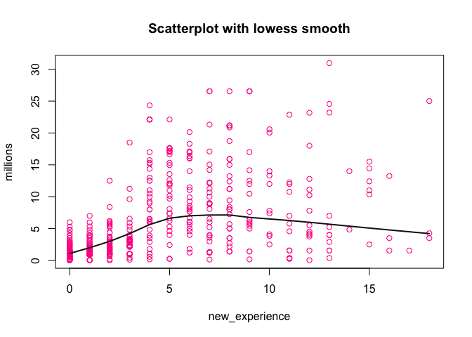
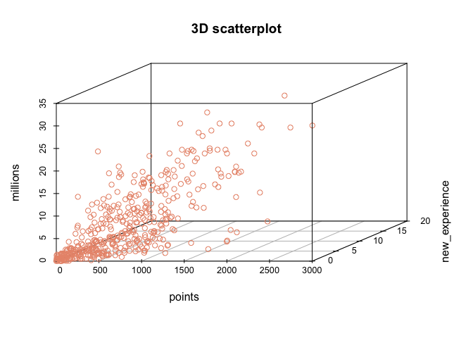
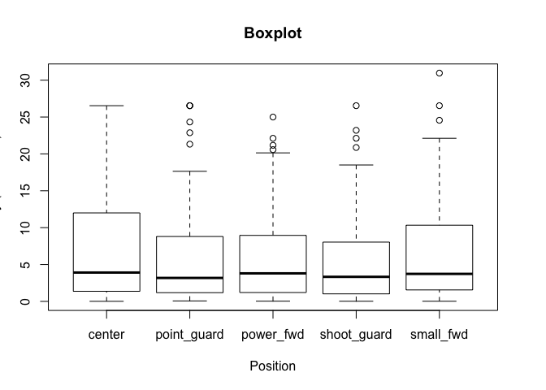

HW01
================
Yijia Qiao
9/22/2017

1. Importing data
-----------------

``` r
# load data file
load("/Users/yijiaqiao/stat133/stat133-hws-fall17/hw01/data/nba2017-salary-points.RData")

# list the available objects
ls()
```

    ## [1] "experience" "player"     "points"     "points1"    "points2"   
    ## [6] "points3"    "position"   "salary"     "team"

2. Research Questions
---------------------

### 1) A bit of data processing

``` r
# data processing
millions <- round (salary / 1000000 , digits = 2)

experience[experience == "R"] <- 0

new_experience <- as.integer(experience)

new_position <- position

new_position[new_position == 'C'] <- 'center'
new_position[new_position == 'SF'] <- "small_fwd"
new_position[new_position == 'PF'] <- "power_fwd"
new_position[new_position == 'SG'] <- "shoot_guard"
new_position[new_position == 'PG'] <- "point_guard"

new_position <- factor(new_position)

# compute the frequencies of new_position
table(new_position)
```

    ## new_position
    ##      center point_guard   power_fwd shoot_guard   small_fwd 
    ##          89          85          89          95          83

### 2) Scatterplot of points and salary

``` r
# scatterplot of points and salary
plot(points, millions, xlab = "Points", ylab = 'Salary(in miilions)', main = "Scatterplot of Points and Salary", col = 'red')
```



### 3) Correlation between points and salary

``` r
# Correlation between points and salary
n <- length(points)
mean_points <- sum(points) / n
mean_salary <- sum(millions) / n
var_points <- 1/(n-1) * sum((points - mean_points)^2)
var_salary <- 1/(n-1) * sum((millions - mean_salary)^2)
sd_points <- sqrt(var_points)
sd_salary <- sqrt(var_salary)
cov_points_salary <- 1/(n-1) * sum((points - mean_points) * (millions - mean_salary))
cor_points_salary <- cov_points_salary / (sd_salary * sd_points)
cor_points_salary
```

    ## [1] 0.6367296

### 4) Simple linear regression

``` r
# simple linear regression
b1 <- cor_points_salary * sd_salary / sd_points
b0 <- mean_salary - b1 * mean_points
y_hat <- b0 + b1 * points
summary(y_hat)
```

    ##    Min. 1st Qu.  Median    Mean 3rd Qu.    Max. 
    ##   1.509   2.844   5.206   6.187   8.184  23.399

#### Answer questions:

##### **What is the regression equation?**

$\\hat{Y} = b\_0 + b\_1 X$ y\_hat = 1.5090766 + 0.0085576 \* X

##### **How do you interpret b1?**

The slope explains how salary relates to points that one player earned. As b1 is positive, it means that when one gets more points, the more he/she earns.

##### **How do you interpret b0?**

The intercept for salary is an error for predicting. It corrects our predictions based only on relation between points and salary.

##### **What are predicted salaries for the following?**

``` r
salary_0 <- b0 + b1 * 0
salary_100 <- b0 + b1 * 100
salary_500 <- b0 + b1 * 500
salary_1000 <- b0 + b1 * 1000
salary_2000 <- b0 + b1 * 2000
```

### 5) Plotting the regression line

``` r
plot(points, millions, xlab = "Points", ylab = 'Salary(in miilions)', main = "Scatterplot with regression", col = 'yellow')
abline(a = b0, b = b1, col = "blueviolet", lwd = 2 )
lines(lowess(points, millions), col = "red", lwd = 2)
text(2000, 15, "regression", col = "blueviolet")
text (2000, 25, "lowess", col = "red")
```



### 6) Regression residuals and Coefficient of Determination R^2

``` r
e_i <- millions - y_hat
summary(e_i)
```

    ##    Min. 1st Qu.  Median    Mean 3rd Qu.    Max. 
    ## -14.187  -2.792  -1.095   0.000   2.556  18.814

``` r
RSS <- sum(e_i ^ 2)
TSS <- sum((millions - mean_salary)^2)
R_square <- 1 - RSS/TSS
```

### 7) Exploring Position and Experience

``` r
plot(new_experience, millions, col = "deeppink", main = "Scatterplot with lowess smooth")
lines(lowess(new_experience, millions), col = "gray7", lwd = 2)
```



``` r
library("scatterplot3d")
scatterplot3d(points, new_experience, millions, main = "3D scatterplot", color = "darksalmon")
```



``` r
boxplot(millions ~ new_position, main = "Boxplot", ylab = "Salary (in millions)", xlab = "Position")
```



#### Answer questions:

##### **Concise descriptions:**

Although the scatterplot and 3d scatterplot shows in different dimensions, they all reveal the fact that if the player stays longer in the team, he/she gets more salaries. As for the boxplot, even players have various positions, their salaries still have a strong relation with their years in experience.

##### **From the scatterplot, does Experience seem to be related with Salary?**

The relation line is rarely smooth and nearly straight. It seems that salary is slightly related to experience.

##### **From the boxplot, does Position seem to be related with Salary?**

Since five boxes have highly similar distribution patterns, it seems that Position is not related with Salary.

### 8) Comments and Reflections

##### **What things were hard, even though you saw them in class?**

As for me, how to subset boxplot into 5 boxes is relatively hard comparing with other questions in this homework.

##### **What was easy(-ish) even though we haven???t done it in class?**

Labeling plots and changing plot patterns or colors are easy.

##### **If this was the first time you were using git, how do you feel about it?**

It's a little complicated.

##### **If this was the first time using GitHub, how do you feel about it?**

The output file and the way it restored is really simple and easy to use.

##### **Did you need help to complete the assignment? If so, what kind of help? Who helped you?**

I asked lab assistant and GSi for help with 3d scatterplot and boxplot syntaxes.

##### **How much time did it take to complete this HW?**

About two hours.

##### **What was the most time consuming part?**

For 3d scatterplot part.

##### **Was there anything that you did not understand? or fully grasped?**

I did not understand the way that lowess line compiuted.

##### **Was there anything frustrating in particular?**

The most frustrated part is that even I installed 3d packages and run successfully in the console, I still could not knit it.

##### **Was there anything exciting? Something that you feel proud of?**

I am so proud that I finished the first homework.
