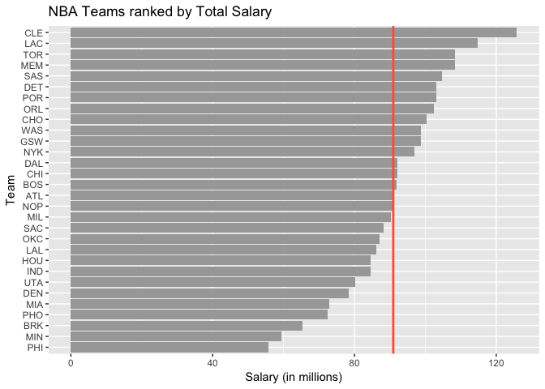
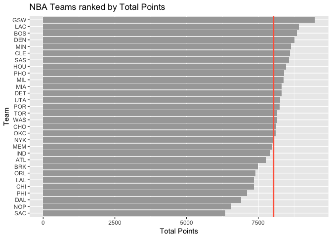
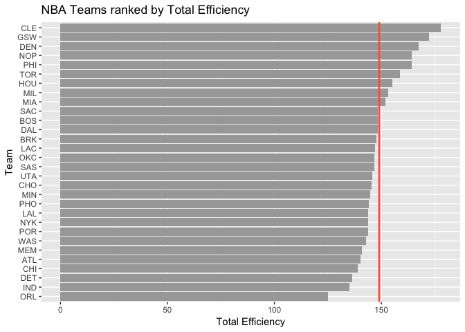
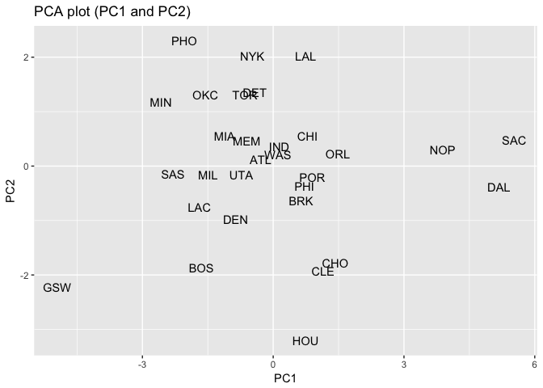
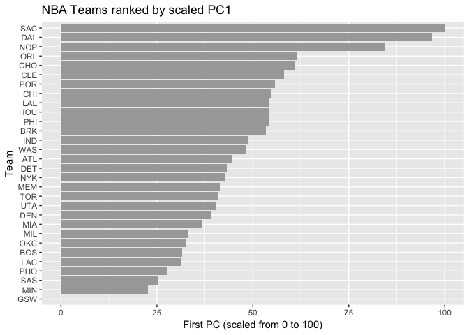

hw03\_Yijia\_Qiao
================
Yijia Qiao
10/12/2017

### 1) About Research Question

If you had to come up with a ranking system for the teams, how would you rank them?

### 2) Data Preparation

See `make-teams-tables.R` in /code folder.

### 3) Basic Rankings

``` r
library(dplyr)
```

    ## 
    ## Attaching package: 'dplyr'

    ## The following objects are masked from 'package:stats':
    ## 
    ##     filter, lag

    ## The following objects are masked from 'package:base':
    ## 
    ##     intersect, setdiff, setequal, union

``` r
library(readr)
library(ggplot2)
teams1 <- read_csv('./data/nba2017-teams.csv')
```

    ## Parsed with column specification:
    ## cols(
    ##   team = col_character(),
    ##   experience = col_integer(),
    ##   salary = col_double(),
    ##   points3 = col_integer(),
    ##   points2 = col_integer(),
    ##   free_throws = col_integer(),
    ##   points = col_integer(),
    ##   off_rebounds = col_integer(),
    ##   def_rebounds = col_integer(),
    ##   assists = col_integer(),
    ##   steals = col_integer(),
    ##   blocks = col_integer(),
    ##   turnovers = col_integer(),
    ##   fouls = col_integer(),
    ##   efficiency = col_double()
    ## )

``` r
teams1 <- arrange(teams1, desc(salary))

#horizontal barplot
#salary
ggplot(data = teams1, aes(x = reorder(team, salary), y = salary)) + geom_bar(stat = 'identity', fill = 'gray66') + coord_flip() + labs(y = 'Salary (in millions)', x = 'Team', title = 'NBA Teams ranked by Total Salary') + geom_hline(yintercept = mean(teams1$salary), color = 'tomato', size = 1)
```



``` r
#total points
ggplot(data = teams1, aes(x = reorder(team, points), y = points)) + geom_bar(stat = 'identity', fill = 'gray66') + coord_flip() + labs(y = 'Total Points', x = 'Team', title = 'NBA Teams ranked by Total Points') + geom_hline(yintercept = mean(teams1$points), color = 'tomato', size = 1)
```



``` r
#efficiency
ggplot(data = teams1, aes(x = reorder(team, efficiency), y = efficiency)) + geom_bar(stat = 'identity', fill = 'gray66') + coord_flip() + labs(y = 'Total Efficiency', x = 'Team', title = 'NBA Teams ranked by Total Efficiency') + geom_hline(yintercept = mean(teams1$efficiency), color = 'tomato', size = 1)
```



-   Concise descriptions of the obtained rankings:

The rankings by Total Salary and Total Efficiency give the same result of top team -- CLE but the they give totally different results for other teams. In General, the three rankings show similar results considering three divisions: a team would have higher salary if it ranks relatively high in total efficiency and total points. However, there is exception. For example, although team ORL has the lowest efficiency and gets relatively low points, it has relatively high salary (more than the average salary). Hence, either one of three ranking standards cannot ensure which team is the best team.

### 4)Principal Components Analysis (PCA)

``` r
pca <- prcomp(teams1[c('points3', 'points2', "free_throws", 'off_rebounds', 'def_rebounds', 'assists', 'steals', 'blocks', 'turnovers', 'fouls')], scale. = TRUE)
pca
```

    ## Standard deviations (1, .., p=10):
    ##  [1] 2.1669994 1.3046111 0.9897094 0.8784756 0.7308134 0.6913872 0.6182263
    ##  [8] 0.5101592 0.3655034 0.2503921
    ## 
    ## Rotation (n x k) = (10 x 10):
    ##                     PC1         PC2         PC3          PC4         PC5
    ## points3      -0.1121782 -0.65652993  0.28806873 -0.042637313  0.28657624
    ## points2      -0.3601766  0.32892544 -0.06763180 -0.347710703 -0.15173866
    ## free_throws  -0.3227564 -0.17651228  0.39157491  0.147596178 -0.21363792
    ## off_rebounds -0.3029366  0.35931603  0.33884845 -0.288483019 -0.16571824
    ## def_rebounds -0.3719432 -0.12808273  0.15026131 -0.492969442  0.26476256
    ## assists      -0.3125312 -0.44134618 -0.26294129 -0.088066602 -0.36972525
    ## steals       -0.3447256 -0.03540585 -0.48554101  0.177578661 -0.33549491
    ## blocks       -0.3162237  0.06131890 -0.48869371  0.003935374  0.65459381
    ## turnovers    -0.3353958 -0.02169833  0.08910421  0.532117541 -0.04471763
    ## fouls        -0.3072548  0.28954426  0.26469871  0.454751471  0.26814214
    ##                       PC6         PC7         PC8         PC9         PC10
    ## points3      -0.028435666  0.38167878 -0.18027569 -0.20631322  0.409762462
    ## points2      -0.088714347  0.07302430  0.47216199 -0.35836740  0.499011524
    ## free_throws  -0.487342521 -0.62732220 -0.07726675 -0.08283563 -0.006875686
    ## off_rebounds  0.283093235  0.13535335 -0.64646479 -0.14735551 -0.124601143
    ## def_rebounds  0.066309015 -0.04926346  0.23787252  0.64632050 -0.168579984
    ## assists       0.176019008  0.11785039  0.18235775 -0.34086739 -0.547385461
    ## steals       -0.303664534  0.25883825 -0.32703573  0.41596580  0.246739300
    ## blocks       -0.009954065 -0.30799231 -0.23947533 -0.27071160 -0.057627209
    ## turnovers     0.675777660 -0.18850849  0.14308362  0.13524769  0.250947823
    ## fouls        -0.298848473  0.47268121  0.21462859 -0.04367200 -0.335087245

``` r
eigs <- data.frame(
  eigenvalues = round(pca$sdev^2,4),
  prop = round(pca$sdev^2/sum(pca$sdev^2), 4)
)
eigs <- mutate(eigs, cumprop = cumsum(eigs$prop))
eigs
```

    ##    eigenvalues   prop cumprop
    ## 1       4.6959 0.4696  0.4696
    ## 2       1.7020 0.1702  0.6398
    ## 3       0.9795 0.0980  0.7378
    ## 4       0.7717 0.0772  0.8150
    ## 5       0.5341 0.0534  0.8684
    ## 6       0.4780 0.0478  0.9162
    ## 7       0.3822 0.0382  0.9544
    ## 8       0.2603 0.0260  0.9804
    ## 9       0.1336 0.0134  0.9938
    ## 10      0.0627 0.0063  1.0001

``` r
pca1 <- data.frame(
  PC1 = pca$x[ , 1],
  PC2 = pca$x[ , 2],
  names = teams1$team
)
```

``` r
#PCA plot
ggplot(pca1, aes(x = PC1, y = PC2)) + geom_text(aes(label = names)) + ggtitle("PCA plot (PC1 and PC2)")
```



``` r
#recale PC1
s1 <- 100 * (pca1$PC1 - min(pca1$PC1)) / (max(pca1$PC1)- min(pca1$PC1))
pca2 <- mutate(pca1, s1)

#barchart
ggplot(data = pca2, aes(x = reorder(names, s1), y = s1)) + geom_bar(stat = 'identity', fill = 'gray66') + coord_flip() + labs(y = 'First PC (scaled from 0 to 100)', x = 'Team', title = 'NBA Teams ranked by scaled PC1') 
```



-   Brief description of PC1 index to rank the teams

By calculating the linear correlations between those given variables, the principal components of teams show a clear and distinct ranking system comparing with ordinary ranking analysis. The top team with the highest PC1 index is GSW and the lowest team is SAC. There is a large index gap between PC1 index of SAC and of GSW. Since the PC1 index considers each part of ranking variables, the large index gap can tell the difference between two teams and gives a high rank to GSW.

### 5) Comments and Reflections

-   Reflect on what was hard/easy, problems you solved, helpful tutorials you read, etc.

PCA part was relatively hard and reading the R manuals and lecture slides helps me to understand the structure of list I got from prcomp() function.

-   Was this your first time working on a project with such file structure? If yes, how do you feel about it?

Yes, this is my first time. I felt difficult to remember what data name I already used in previous codes.

-   Was this your first time using relative paths? If yes, can you tell why they are important for reproducibility purposes?

No. Without choosing file from the beginning, I saved a lot of time by working in my current directory.

-   Was this your first time using an R script? If yes, what do you think about just writing code?

No.

-   What things were hard, even though you saw them in class/lab?

PCA part is hard as for me. It is hard to imagine the data structure when it's beyond 2D.

-   What was easy(-ish) even though we haven???t done it in class/lab?

Doing relative paths is easy.

-   Did anyone help you completing the assignment? If so, who?

Piazza.

-   How much time did it take to complete this HW?

Half day.

-   What was the most time consuming part?

Understanding data structure got from PCA function and how to plot using those data.

-   Was there anything interesting?

Creating new files by typing codes in one window is interesting.
