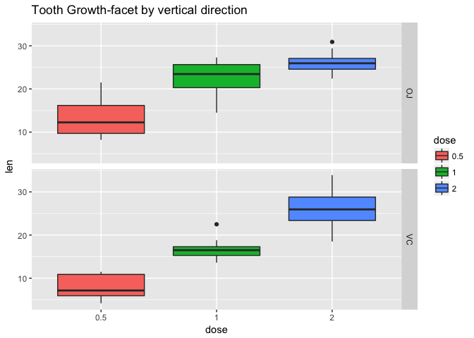
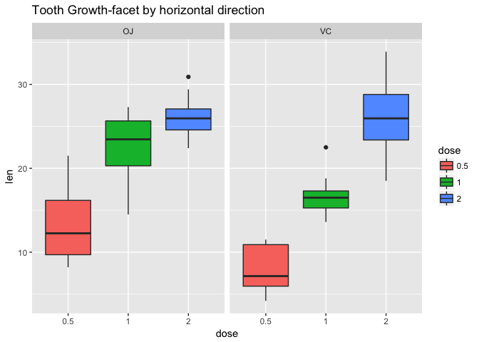
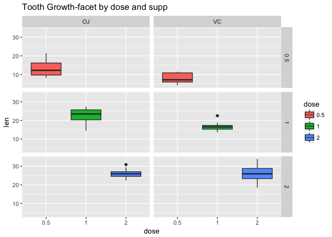
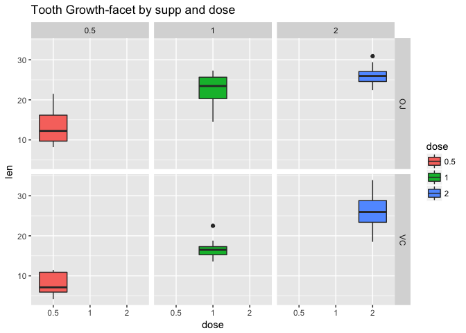
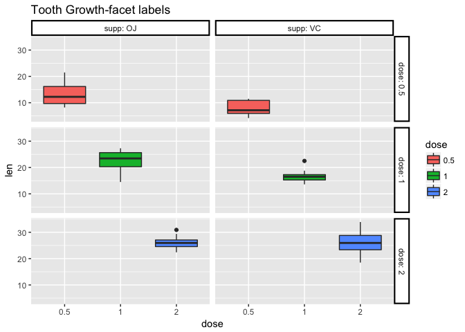
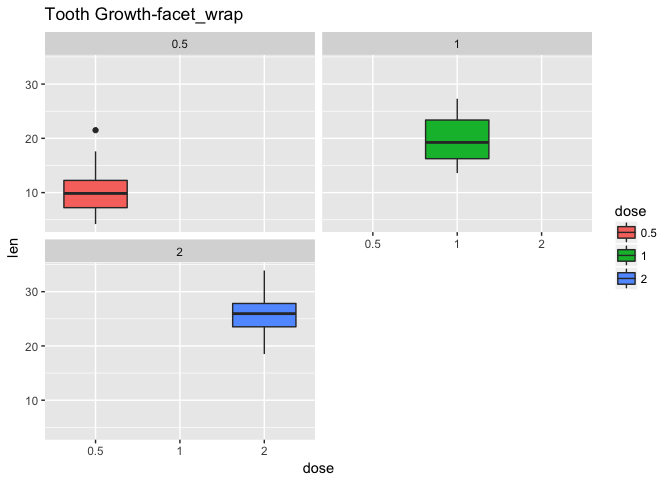
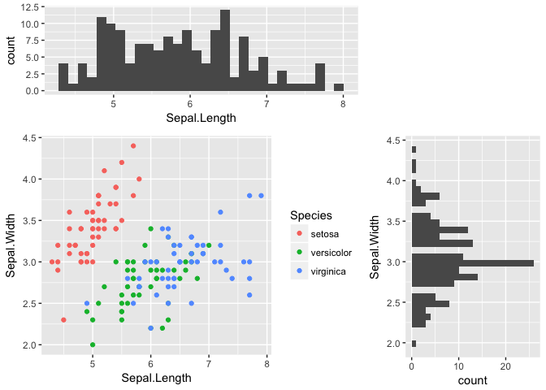

Faceting--Better Data Visualization with Plot Partition
================
Yijia Qiao
10/30/2017

Motivation
----------

What is the first word appears in your mind when you think about 'statistics'?
Data? Long lists of data in black with the white background?

That would be typical impression with statistics of most people. However, statistics is not only about what data is, but also is about how does data look like. Data carries various information to statisticians. The categorical information of data and the relationship between each category are all behind data. The best way to present those pieces of information from data is the plot.

Nowadays, as more and more people are interested in digital marketing, statisticians are willing to create fine and elaborate graphs from data to convince their audiences. Here comes `ggplot2`.

Introduction
------------

`ggplot2` is an R package created by [Hadley Wickham](http://hadley.nz). It provides omnipotent functions for plotting various graphs with massive data. There are basic functions for plotting and visual aesthetics that can be added on different layers. With different layers added together, the full plot with desired geometric aesthetics comes out. However, sometimes displaying all the data in one plot may result in confusion and ambiguity. Especially when data is categorical.

Hence, `ggplot2` has one important concept--"faceting', which helps the plot shows the integrative information within one large diagram that has corresponding subplots. Those subplots can be of one type or of multiple types. There are two types of faceting in `ggplot2`:

-   `facet_grid`
-   `facet_wrap`

Examples
--------

### 1. Basic Barplots with customized colors:


### 2. Grouped Barplot:


### 3. Categorical Barplots by Faceting:


### 4. Dotplots by Faceting:


### 5. Multiple Plots on Same Page:


Discussion
----------

### 1) How does faceting works in `ggplot2`?

When I first saw the output of faceting functions of R, I was completely amazed by its versatility and flexibility. Unlike MATLAB's subplot functions, `ggplot2` package makes it possible to display multiple types of plots on one diagram. The plot partition introduced by Dr. Wickham is quite sophisticated but the theory behind it is actually simple and easy.

First `ggplot2` transforms data to geometric objects with aesthetic attributes. Then given one desired coordinates, those data are corresponding to their own information. The faceting is dividing the whole set of data into several subsets by categories or qualitative standards. Then instead of writing and operating similar codes for each subset, faceting functions operate for each one and generate their plots on one diagram.

The graph below explains the logic of faceting.


### 2) Using Faceting Functions to Partition Plots

#### (a) Data Preparation:

`ggplot2` deals with data in `data.frame` structure. In the following steps, I use R built-in data frame `ToothGrowth` data.

``` r
# library the package
library(ggplot2)

# take a look at data
head(ToothGrowth, 5)
```

    ##    len supp dose
    ## 1  4.2   VC  0.5
    ## 2 11.5   VC  0.5
    ## 3  7.3   VC  0.5
    ## 4  5.8   VC  0.5
    ## 5  6.4   VC  0.5

``` r
# Convert dose from numeric to factor 
ToothGrowth$dose <- as.factor(ToothGrowth$dose)
dat <- ToothGrowth
head(dat, 5)
```

    ##    len supp dose
    ## 1  4.2   VC  0.5
    ## 2 11.5   VC  0.5
    ## 3  7.3   VC  0.5
    ## 4  5.8   VC  0.5
    ## 5  6.4   VC  0.5

#### (b) Faceting with one variable:

The data can be split up by one variable that vary on the horizontal or vertical direction.

This is done by giving a formula to facet\_grid(), of the form `vertical ~ horizontal`.

``` r
# facet by vertical direction
ggplot(dat, aes(x=dose, y=len, group=dose)) + 
  geom_boxplot(aes(fill=dose)) + 
  facet_grid(supp ~ . ) + ggtitle("Tooth Growth-facet by vertical direction") 
```



``` r
# facet by horizontal direction
ggplot(dat, aes(x=dose, y=len, group=dose)) + 
  geom_boxplot(aes(fill=dose)) + 
  ggtitle("Tooth Growth-facet by horizontal direction") +
  facet_grid(. ~ supp)
```



#### (c) Faceting with two variables:

The data can be split up by two variables that vary on the horizontal and vertical direction.

This is done by giving a formula to facet\_grid(), of the form `vertical ~ horizontal`.

``` r
# Facet by two variables: dose and supp.
# Rows are dose and columns are supp. 
ggplot(dat, aes(x=dose, y=len, group=dose)) + 
  geom_boxplot(aes(fill=dose)) +
  ggtitle("Tooth Growth-facet by dose and supp") +
  facet_grid(dose ~ supp)
```



``` r
# reverse the order of the 2 variables: rows are supp and columns are dose.
ggplot(dat, aes(x=dose, y=len, group=dose)) + 
  geom_boxplot(aes(fill=dose)) + 
  ggtitle("Tooth Growth-facet by supp and dose") +
  facet_grid(supp ~ dose)
```



#### (d) Facet labels:

`facet_grid` has argument `labeller` to adjust facet labels and we can use `theme()` to change appearances of facet labels.

``` r
p <- ggplot(dat, aes(x=dose, y=len, group=dose)) + 
  geom_boxplot(aes(fill=dose)) +
  ggtitle("Tooth Growth-facet labels") +
  facet_grid(dose ~ supp, labeller=label_both)

# modify appearances
p +  theme(strip.background = element_rect(colour="black", fill="white", 
                                       size=1.5, linetype="solid"))
```



#### (e) Side by Side Plot Partitions:

`facet_wrap` can partition plots side by side by using argument `ncol =`.

``` r
ggplot(dat, aes(x=dose, y=len, group=dose)) + 
  geom_boxplot(aes(fill=dose)) +
  ggtitle("Tooth Growth-facet_wrap") +
  facet_wrap(~ dose, ncol = 2)
```



#### (f) Multiple plots in one diagram:

Faceting is, to some extent, a rule that tells R how to organize generated subplots in one plane. When we only need to divide the diagram for each subplot, faceting gives us what we want. Whereas, if we want to display different types of plots for subsets of data, faceting cannot satisfy all demands. Another package `grid` provides more advanced functions to back up `ggplot2`.

Here is an example of a combination of `grid` and `ggplot2`:
(P.S. this example uses built-in data: `iris`)

``` r
library(grid)

# take a look at `iris`
head(iris, 5)
```

    ##   Sepal.Length Sepal.Width Petal.Length Petal.Width Species
    ## 1          5.1         3.5          1.4         0.2  setosa
    ## 2          4.9         3.0          1.4         0.2  setosa
    ## 3          4.7         3.2          1.3         0.2  setosa
    ## 4          4.6         3.1          1.5         0.2  setosa
    ## 5          5.0         3.6          1.4         0.2  setosa

``` r
# Show bivariate scatter plot and univariate histogram
p.hist.len <- ggplot(iris) + geom_histogram(aes(x=Sepal.Length))
p.hist.wid <- ggplot(iris) + geom_histogram(aes(x=Sepal.Width)) + coord_flip()
# Make scatter plot of Sepal.Length and Sepal.Width
p.scatter <- ggplot(iris) + geom_point(aes(x=Sepal.Length, y=Sepal.Width, color=Species))

grid.newpage()
pushViewport(viewport(layout = grid.layout(3, 3)))
print(p.scatter, vp=viewport(layout.pos.row=2:3, layout.pos.col=1:2))
print(p.hist.len, vp=viewport(layout.pos.row=1, layout.pos.col=1:2))
```

    ## `stat_bin()` using `bins = 30`. Pick better value with `binwidth`.

``` r
print(p.hist.wid, vp=viewport(layout.pos.row=2:3, layout.pos.col=3))
```

    ## `stat_bin()` using `bins = 30`. Pick better value with `binwidth`.



Conclusion
----------

#### Faceting in `ggplot2` provides an efficient approach to present graphical information from massive data.

#### 1. Faceting refines the single-plot diagram by representing categories or relationships between variables.

#### 2. Faceting offers a nice view of the graph without putting all data in one plot no matter how they distribute.

#### 3. By omitting similar codes and operations, faceting improves the speed of generating subplots.

#### 4. Faceting has its disadvantages when it encounters more sophisticated situations, such as displaying multifunctional plots.

#### 5. Combining `grid` and `ggplot2` makes the fabulous data visualization.

Reference
---------

1.  <http://hadley.nz>
2.  <http://www.r-graph-gallery.com/portfolio/ggplot2-package/>
3.  <https://segmentfault.com/a/1190000006120665#articleHeader1>
4.  <http://www.sthda.com/english/wiki/ggplot2-facet-split-a-plot-into-a-matrix-of-panels>
5.  <http://www.cookbook-r.com/Graphs/Facets_(ggplot2)/#modifying-facet-label-text>
6.  <http://www.cookbook-r.com/Graphs/Facets_(ggplot2)/#facetgrid>
7.  <https://www3.nd.edu/~steve/computing_with_data/13_Facets/facets.html>
8.  <https://plot.ly/ggplot2/facet_wrap/>
