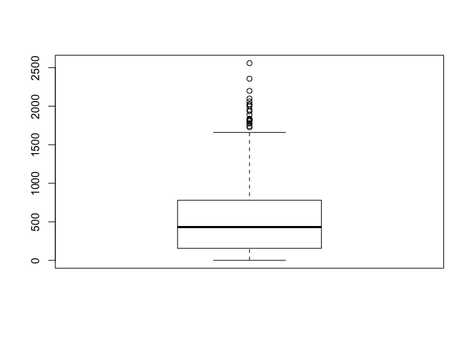

up02-Yijia-Qiao
================
Yijia Qiao
9/15/2017

**1. Data Analysis for Quantitative Variables**
===============================================

``` r
load("/Users/yijiaqiao/stat133/stat133-hws-fall17/warmup02/data/nba2017-salary-points.RData")
ls()
```

    ## [1] "experience" "player"     "points"     "points1"    "points2"   
    ## [6] "points3"    "position"   "salary"     "team"

``` r
summary(points)
```

    ##    Min. 1st Qu.  Median    Mean 3rd Qu.    Max. 
    ##     0.0   156.0   432.0   546.6   780.0  2558.0

``` r
mean(points)
```

    ## [1] 546.6054

``` r
sd(points)
```

    ## [1] 489.0156

``` r
min(points)
```

    ## [1] 0

``` r
max(points)
```

    ## [1] 2558

``` r
median(points)
```

    ## [1] 432

``` r
quantile(points)
```

    ##   0%  25%  50%  75% 100% 
    ##    0  156  432  780 2558

``` r
IQR(points)
```

    ## [1] 624

``` r
boxplot(points)
```



``` r
# The histogram along with the density curve of points.
hist(points, prob = TRUE, col = "lavender")
lines(density(points), col = "blue")
```


**2. Data Analysis for Qualitative Variables**
==============================================

``` r
factor (team)
```

    ##   [1] BOS BOS BOS BOS BOS BOS BOS BOS BOS BOS BOS BOS BOS BOS BOS CLE CLE
    ##  [18] CLE CLE CLE CLE CLE CLE CLE CLE CLE CLE CLE CLE CLE TOR TOR TOR TOR
    ##  [35] TOR TOR TOR TOR TOR TOR TOR TOR TOR TOR TOR WAS WAS WAS WAS WAS WAS
    ##  [52] WAS WAS WAS WAS WAS WAS WAS WAS ATL ATL ATL ATL ATL ATL ATL ATL ATL
    ##  [69] ATL ATL ATL ATL ATL MIL MIL MIL MIL MIL MIL MIL MIL MIL MIL MIL MIL
    ##  [86] MIL MIL IND IND IND IND IND IND IND IND IND IND IND IND IND IND CHI
    ## [103] CHI CHI CHI CHI CHI CHI CHI CHI CHI CHI CHI CHI CHI CHI MIA MIA MIA
    ## [120] MIA MIA MIA MIA MIA MIA MIA MIA MIA MIA MIA DET DET DET DET DET DET
    ## [137] DET DET DET DET DET DET DET DET DET CHO CHO CHO CHO CHO CHO CHO CHO
    ## [154] CHO CHO CHO CHO CHO CHO CHO NYK NYK NYK NYK NYK NYK NYK NYK NYK NYK
    ## [171] NYK NYK NYK NYK NYK ORL ORL ORL ORL ORL ORL ORL ORL ORL ORL ORL ORL
    ## [188] ORL ORL ORL PHI PHI PHI PHI PHI PHI PHI PHI PHI PHI PHI PHI PHI PHI
    ## [205] PHI BRK BRK BRK BRK BRK BRK BRK BRK BRK BRK BRK BRK BRK BRK BRK GSW
    ## [222] GSW GSW GSW GSW GSW GSW GSW GSW GSW GSW GSW GSW GSW GSW SAS SAS SAS
    ## [239] SAS SAS SAS SAS SAS SAS SAS SAS SAS SAS SAS SAS HOU HOU HOU HOU HOU
    ## [256] HOU HOU HOU HOU HOU HOU HOU HOU HOU LAC LAC LAC LAC LAC LAC LAC LAC
    ## [273] LAC LAC LAC LAC LAC LAC LAC UTA UTA UTA UTA UTA UTA UTA UTA UTA UTA
    ## [290] UTA UTA UTA UTA UTA OKC OKC OKC OKC OKC OKC OKC OKC OKC OKC OKC OKC
    ## [307] OKC OKC OKC MEM MEM MEM MEM MEM MEM MEM MEM MEM MEM MEM MEM MEM MEM
    ## [324] MEM POR POR POR POR POR POR POR POR POR POR POR POR POR POR DEN DEN
    ## [341] DEN DEN DEN DEN DEN DEN DEN DEN DEN DEN DEN DEN DEN NOP NOP NOP NOP
    ## [358] NOP NOP NOP NOP NOP NOP NOP NOP NOP NOP DAL DAL DAL DAL DAL DAL DAL
    ## [375] DAL DAL DAL DAL DAL DAL DAL DAL SAC SAC SAC SAC SAC SAC SAC SAC SAC
    ## [392] SAC SAC SAC SAC SAC SAC MIN MIN MIN MIN MIN MIN MIN MIN MIN MIN MIN
    ## [409] MIN MIN MIN LAL LAL LAL LAL LAL LAL LAL LAL LAL LAL LAL LAL LAL LAL
    ## [426] LAL PHO PHO PHO PHO PHO PHO PHO PHO PHO PHO PHO PHO PHO PHO PHO
    ## 30 Levels: ATL BOS BRK CHI CHO CLE DAL DEN DET GSW HOU IND LAC LAL ... WAS

``` r
A <- table (team)
B <- A/length(team)
barplot(A, col = "lavender")
title(main = "frequency table of team", font.main = 6)
```


``` r
barplot(B, col = 'mistyrose')
title(main = "relative frequency of team", font.main = 6)
```


**3. Warmup02 Summary**
=======================

### What is the overall shape?

-   The overall shape of the histogram is right-tailed.

### What is the typical center?

-   The typical center of the histogram is the median that divides the diagram into two parts of even area.

### Overall range, along with an interval of typical measurements.

-   The players score points from 0 to 2558. The first quartile is 156 points and the third quartile is 780 points. The median is 432 points and all scores average at 546.6 points.
